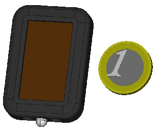
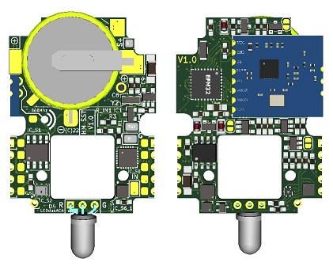
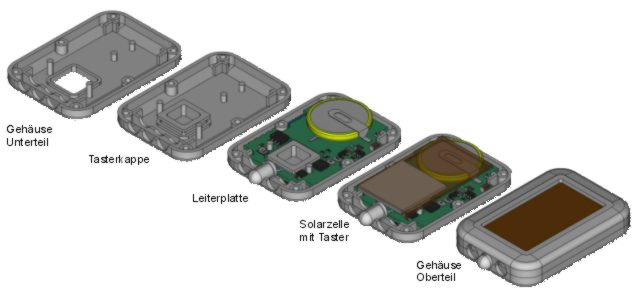

# SolarSensorTag
Smarthome Sensor mit Akku und Solarzelle  
Status: erste Prototypen als Temperatur+Luftfeuchte Sensor laufen seit 08/2022

> 

##  Features
- kleine Abmessungen
- Akku Ladungserhaltung bei etwas Tageslicht ohne direkte Sonne
- vielfache Bestückungsmöglichkeiten mit unterschiedlichen Sensoren
- Solarzelle und Gehäuse können von einer sehr preiswerten Mini-Taschenlampe verwendet werden (auch China Clones) - *"Solar Power Flash Light"* googeln

## Hardware
- Prozessor der SiLabs EFM32 Serie
- CC1101 Modul
- opt. EEPROM
- Solarzelle 4V
- Akku Kopfzelle, z.B. VL2020
- Dual-Color LED
- zum Gehäuse passende Leiterplatte
  
- Aufbau
   
 
## Software
- Entwicklungsumgebung Silikon Labs Simplicity Studio mit GeckoSDK
- Unfangreiches eigenes API mit Arduino ähnlichen Funktionen, das auf dem SiLabs GeckoSDK aufsetzt  
  (damit sind Sourcecode Teile aus Arduino Sketches einsetzbar)
- Watchdog
- Schutz des Akkus vor Überladung durch Software
- Menü zur Bedienung mit einem Button 
- Debug Ausgabe (emuliert)
- verschiedene RF Protokolle sind in der Entwicklung, u.a.  
  Homematic [ASKSINPP](https://github.com/pa-pa/AskSinPP)
- STM32 Version geplant, wenn MCU's verfügbar sind 
  
## Projekte
- [HM-WDS10-TH-I](projects/HM-WDS10-TH/README.md "")/HM-WDS10-TH-O Temperatur/Feutigkeitssensor

## Add on's
- Halter für Blumentöpfe [```JPG```](addon/plantsticker/plant-sticker.jpg) [```STL```](addon/plantsticker/plant-sticker.stl)
   
## Getting Started
- keine Zeit? dann direkt zu einer Projektseite wechseln
- Schaltplan mit allen Optionen [```PDF```](efm32/schematics/SolarSensorTagEFM32-schematics.pdf) [```JPG```](efm32/schematics/SolarSensorTagEFM32-schematics.jpg)
- Bauteileliste mit allen Optionen [```PDF```](efm32/partlist/SolarSensorTagEFM32-parts.pdf)
- PCB im Verzeichnis efm32/pcb/gerber
- Bestückungsplan [```PDF```](efm32/pcb/assembly/SolarSensorTagEFM32-assembly.pdf)

## Entwicklung
- Programmieradapter [```README```](develop/progadapt/README.md)
 

## Lizenz
- [Creative Commons 3.0](http://creativecommons.org/licenses/by-nc-sa/3.0/de/)  
  
<br><br>
   
**Thanks to**
+ [pa-pa](https://github.com/pa-pa) für seine Arbeit an ASKSINPP


