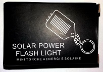
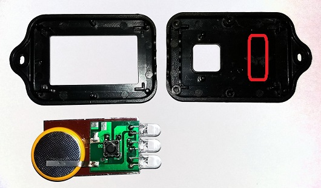
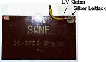
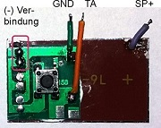
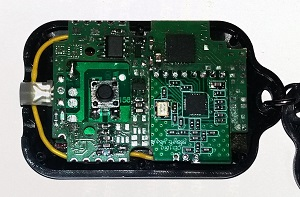

# HM-WDS-10
Temperatur+Luftfeuchte Sensor for Homematic

## Bauteile
- die STT Leiterplatte wird mit wenigen Bauteilen bestückt  
  Bestückungsliste [``PDF``](SolarSensorTag-THSensor-Parts.pdf)
- zum Einsatz kommt ein VL2020/HFN Akku mit Lötfahnen der direkt auf der Leiterplatte bestückt wird  

## Aufbau

Als Basis für Solarzelle und Gehäuse dient eine Mini-Taschenlampe (hier China Clone). 

Bei manchen Geäusen muß man noch einen/zwei Abstandhalter oder Stifte (rot) entfernen damit die Leiterplatte rein passt. Einige Clones haben statt einem Akku nur eine CR2032 Batterie - aber bisher alle - eine funktionierende Solarzelle. Die Leiterplatte mit Taster ist dann manchmal so aufgeklebt, daß man die Anschlüsse der Solarzelle nicht sieht.

 
Ggf. Leiterplatte mit Taster ablösen und an der richtigen Stelle aufkleben. Batterie und LEDs entfernen und Anschlussdrähte anlöten.  
Achtung (!) sollte die Solarzelle bisher nicht angeschlossen sein:  
Die Kontakte der Solarzelle lassen sich meist nur mit Niedertemperatur Lötzinn verlöten, da diese sonst wegbrennen. Hier ist es besser das (+) Kabel mit einem Tropfen UV Kleber zu befestigen und die Verbindung mit Silberleitlack herzustellen.

 

Oberseite der VL2020 Batterie mit einem Stück Tesa isolieren. 
Verbindungen an die Leiterplatte anlöten und alles ins Gehäuse einpassen.

## Bedienung
- Die Bedieung erfolt über den Taster. Anders als bei bei Standard Homematic Sensoren ist ein Menü implementiert über das mehrere Funktionen auswählbar sind.  
   [siehe doc](../source/doc/menu-states.jpg)

## Lizenz
- [Creative Commons 3.0](http://creativecommons.org/licenses/by-nc-sa/3.0/de/)  
  
  
**Thanks to**
+ [pa-pa](https://github.com/pa-pa) für seine Arbeit an ASKSINPP

